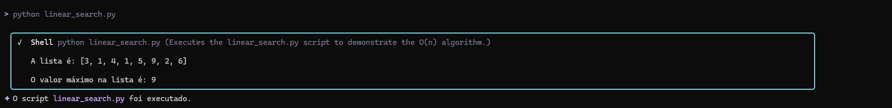
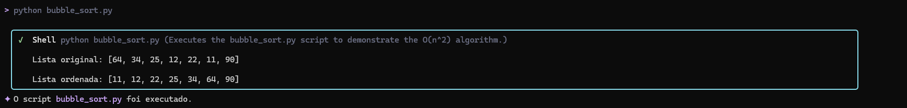
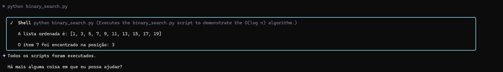

# Atividade de Algoritmos e Complexidade

## 📝 Descrição do Projeto

[cite_start]Este repositório contém três implementações de algoritmos em Python, cada um demonstrando um princípio fundamental de **Complexidade de Tempo (Notação Big O)**, conforme solicitado na atividade[cite: 221, 223]. [cite_start]Esta atividade prática faz parte da disciplina de Algoritmo e Complexidade[cite: 219].

[cite_start]A ferramenta utilizada para auxiliar na geração dos códigos, testes e documentação foi o **Gemini CLI**, atuando como o **MCP Client** (Cliente de Computação Preditiva Multi-Modal), conforme instruído[cite: 231, 232].

---

## 💻 Ferramenta Utilizada: Gemini CLI (MCP Client)

[cite_start]A atividade exigiu a instalação do **Node.js (versão 20 ou superior)** e do CLI[cite: 232, 125]. [cite_start]O Gemini CLI foi utilizado para interagir com o modelo Gemini, expondo funcionalidades como a geração de código e documentação[cite: 234].

* **Prompt Principal (Elaborado para a atividade):**
    ```
    Gere 3 códigos Python, cada um implementando um algoritmo diferente: 1) Um com complexidade O(n) (Linear); 2) Um com complexidade O(n^2) (Quadrática); 3) Um com complexidade O(log n) (Logarítmica). Para cada código, inclua a notação de complexidade no comentário da função, um teste de uso e uma breve documentação explicando o princípio do algoritmo. Salve os códigos em três arquivos separados.
    ```
* **Print da Geração do Código (Visão do Terminal):**
    *A imagem demonstra o Gemini CLI executando o prompt e gerando o arquivo `linear_search.py` e sua estrutura, incluindo a documentação interna e a complexidade $O(n)$.*


---

## 📊 Algoritmos Implementados e Análise de Complexidade

| Arquivo | Algoritmo | Notação Big O | Descrição |
| :--- | :--- | :--- | :--- |
| `linear_search.py` | Encontrar Máximo (Linear) | $O(n)$ | O tempo de execução é diretamente proporcional ao tamanho da lista ($n$). No pior caso, o algoritmo precisa percorrer todos os elementos. |
| `bubble_sort.py` | Bubble Sort (Ordenação por Bolha) | $O(n^2)$ | [cite_start]A complexidade quadrática é típica de algoritmos com *loops* aninhados[cite: 225]. O número de operações cresce muito rapidamente com o aumento do tamanho da entrada. |
| `binary_search.py` | Busca Binária | $O(\log n)$ | O algoritmo divide o espaço de busca pela metade a cada iteração, tornando-o muito eficiente. **A lista deve estar previamente ordenada.** |

---

## 🔬 Testes e Resultados (Comprovação da Execução)

[cite_start]Os prints abaixo demonstram a execução dos scripts gerados e a comprovação dos testes, conforme exigido pela atividade[cite: 226].

### 1. Teste do Algoritmo Linear ($O(n)$)

*O script calcula o valor máximo em uma lista, exigindo que todos os elementos sejam inspecionados.*


### 2. Teste do Algoritmo Quadrático ($O(n^2)$)

*O script executa a Ordenação por Bolha, demonstrando a complexidade $O(n^2)$ ao ordenar a lista.*


### 3. Teste do Algoritmo Logarítmico ($O(\log n)$)

*O script executa a Busca Binária em uma lista ordenada, encontrando a posição de um item específico.*


---

## 💾 Como Acessar e Executar

1.  **Clone o repositório:**
    ```bash
    git clone [COPIE E COLE AQUI O LINK DO SEU REPOSITÓRIO]
    ```
2.  **Navegue até o diretório:**
    ```bash
    cd Gemini-CLI
    ```
3.  **Execute um dos scripts (exemplo):**
    ```bash
    python bubble_sort.py
    ```
